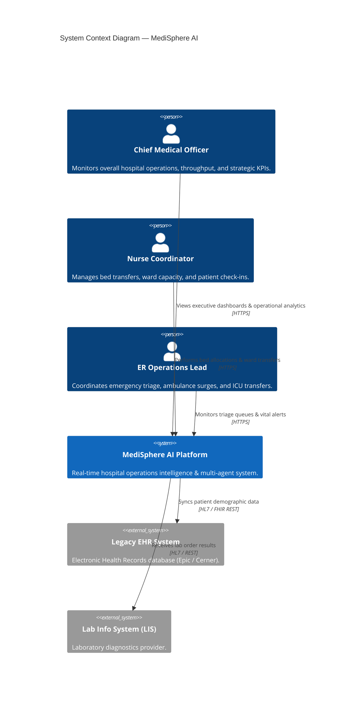
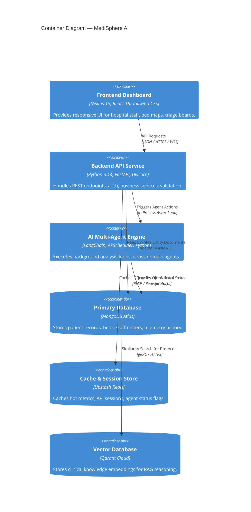
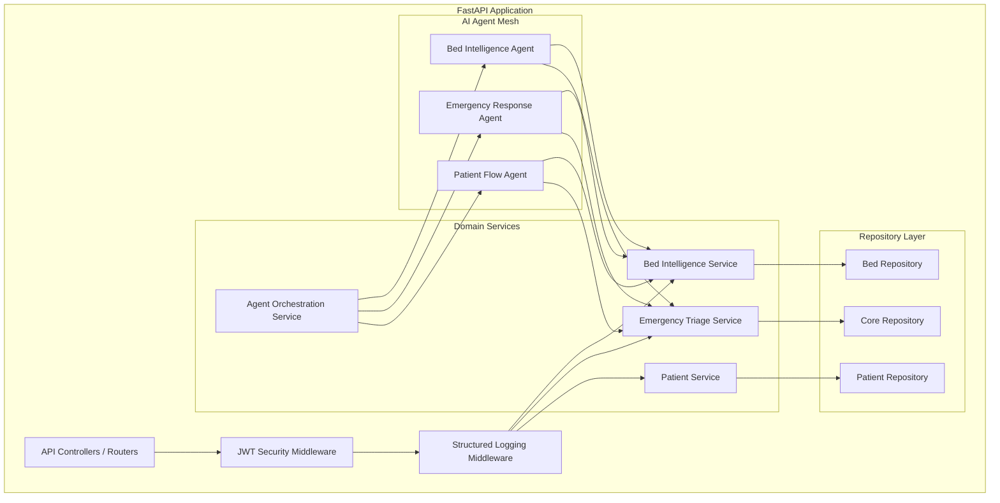
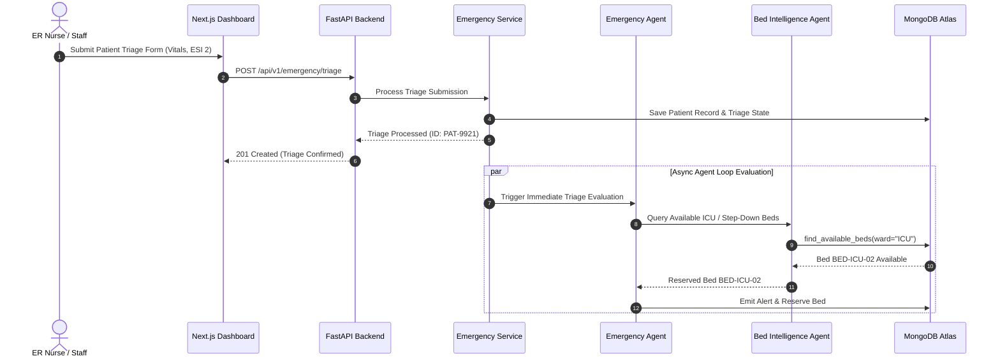

# Phase 3 — System Architecture Document: MediSphere AI

## 1. High-Level Architecture (HLD)

MediSphere AI is designed as a **Modular Monolith** applying **Domain-Driven Design (DDD)** and **Hexagonal Architecture (Ports and Adapters)**. 

The application architecture separates presentation (Next.js 15 App Router), API routing (FastAPI Controllers), business domain logic (Services), multi-agent intelligence orchestration (Agent Engine), and persistence (MongoDB Atlas, Upstash Redis, Qdrant Cloud).

---

## 2. C4 Model Diagrams

### 2.1 System Context Diagram (Level 1)

---

### 2.2 Container Diagram (Level 2)

---

### 2.3 Component Diagram (Level 3 — Backend API)

---

## 3. Sequence Diagrams

### 3.1 Emergency Patient Admission & Automated Triage Sequence

---

## 4. Architecture Decision Records Summary

| ADR ID | Title | Selected Technology | Rationale |
| :--- | :--- | :--- | :--- |
| **ADR-001** | Primary Document Store | MongoDB Atlas | Schema flexibility, native async Motor support, high availability. |
| **ADR-002** | Web Framework & Architecture | FastAPI + Hexagonal DDD | Pure async performance, Pydantic validation, explicit layer separation. |
| **ADR-003** | Agent Orchestration Engine | APScheduler + LangChain | Lightweight async event loop, deterministic agent coordination. |
| **ADR-004** | Vector Database Engine | Qdrant Cloud | High-speed HNSW indexing, cloud multi-tenancy, gRPC performance. |
| **ADR-005** | Authentication Scheme | JWT + Argon2id | OWASP compliant stateless auth, brute-force resistant password hashing. |
